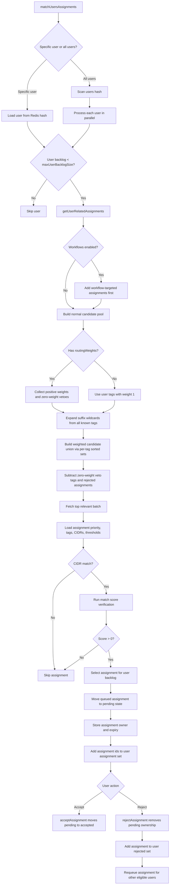
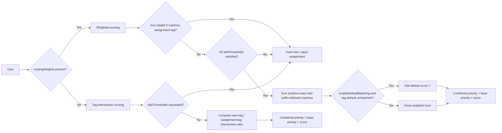
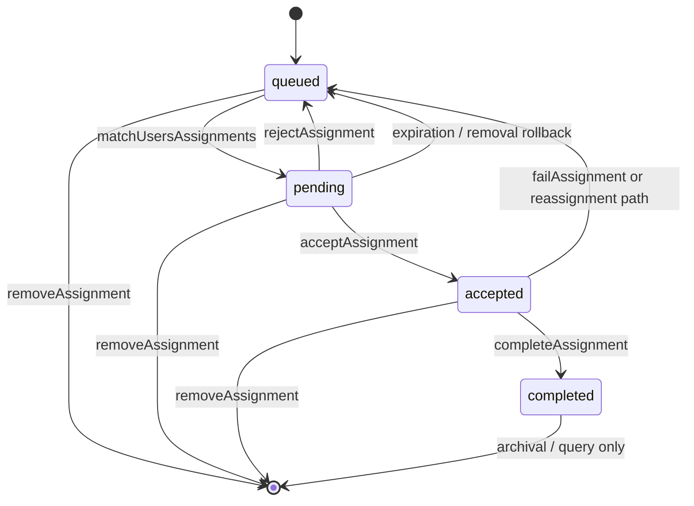

# Copilot instructions for `assignment-user-matcher`

## Project purpose
- This repository is a TypeScript library for Redis-backed assignment-to-user matching.
- The main product is the published package exposed from [src/index.ts](src/index.ts).
- Core responsibilities are:
  - tag and weighted-skill based matching,
  - backlog-aware assignment distribution,
  - assignment lifecycle management (`queued` → `pending` → `accepted` → `completed`),
  - optional workflow orchestration on top of assignments,
  - Redis-friendly querying and pagination.

## Repository structure
- Core public API: [src/index.ts](src/index.ts)
- Main facade and runtime orchestration: [src/matcher.class.ts](src/matcher.class.ts)
- Shared types and public contracts: [src/types/matcher.ts](src/types/matcher.ts)
- Workflow DSL and builder helpers: [src/workflow-builder.ts](src/workflow-builder.ts)
- Workflow orchestration internals: [src/managers/WorkflowManager.ts](src/managers/WorkflowManager.ts)
- Workflow reliability helpers: [src/managers/ReliabilityManager.ts](src/managers/ReliabilityManager.ts)
- Telemetry wrapper: [src/managers/TelemetryManager.ts](src/managers/TelemetryManager.ts)
- Matching and scoring helpers: [src/scoring/match-score.ts](src/scoring/match-score.ts)
- Assignment query/pagination helpers: [src/queries/pagination.ts](src/queries/pagination.ts)
- Redis key naming: [src/utils/keys.ts](src/utils/keys.ts)
- Lua for atomic workflow transitions: [src/lua/workflow-transition.lua](src/lua/workflow-transition.lua)
- Library test suite: [tests](tests)
- Demo backend and demo app: [example/server](example/server)

## How to think about changes
- Treat [src/matcher.class.ts](src/matcher.class.ts) as the main orchestration layer, not as a dumping ground for unrelated helpers.
- Put pure matching logic in focused helpers when possible, following the existing pattern in [src/scoring/match-score.ts](src/scoring/match-score.ts) and [src/queries/pagination.ts](src/queries/pagination.ts).
- Keep public types centralized in [src/types/matcher.ts](src/types/matcher.ts).
- Keep public exports stable in [src/index.ts](src/index.ts). If a new public feature is added, update exports deliberately.
- Changes in [src/matcher.class.ts](src/matcher.class.ts) must preserve the existing public contract and remain backward compatible unless a breaking change is explicitly requested.
- Reuse [src/utils/keys.ts](src/utils/keys.ts) for any Redis key additions. Do not hardcode new key strings in multiple places.

## Core matching rules that must stay consistent
- Default matching is tag-based and Redis-backed.
- `routingWeights` are the weighted matching mechanism.
- Only positive weights (`> 0`) make an assignment eligible.
- Weight `0` is a hard veto.
- Wildcards are suffix-only prefix matches such as `lang:*` or `skill:*`.
- Patterns like `skill:*:node` are not supported wildcard syntax.
- If a user has `routingWeights` but no positive entries, assignments should stay queued.
- `enableDefaultMatching` injects and matches the `default` tag behavior; preserve this carefully.
- `usingDefaultMatchScore` is an internal detail, not a public option.
- CIDR filtering and `skillThresholds` are first-class matching constraints and must be preserved when changing scoring or candidate selection.

## Matchmaking logic diagrams

### Diagram reading notes
- Candidate discovery is Redis-first: per-tag sorted sets are unioned and diffed before final per-assignment scoring.
- Workflow-targeted assignments take precedence before generic tag/weight-based selection.
- Weighted routing uses positive matches for eligibility and score accumulation, while `0` remains a hard veto.
- Final acceptance still depends on CIDR checks, threshold checks, and `matchScore()` verification before moving an assignment to pending.
- Rejection is user-specific: the assignment is requeued, but the rejecting user is prevented from immediate reassignment through the rejected-assignment set.

## Assignment lifecycle expectations
- The matcher maintains separate Redis stores for queued, pending, accepted, and completed assignments.
- Preserve lifecycle transitions and state invariants when modifying matching logic:
  - queued assignments live in the main assignment stores,
  - matched assignments move to pending,
  - accepted assignments move to accepted storage,
  - completed assignments move to completed storage with metadata.
- When changing removal or transition logic, update all affected Redis indexes, especially per-tag sorted sets and ownership metadata.
- Prefer atomic or batched Redis operations with `multi()` for state transitions.

## Workflow architecture expectations
- Workflow features are optional and hang off the matcher; they are not a separate product.
- `AssignmentMatcher` is the host, while [src/managers/WorkflowManager.ts](src/managers/WorkflowManager.ts) owns workflow execution mechanics.
- Reliability concerns belong in [src/managers/ReliabilityManager.ts](src/managers/ReliabilityManager.ts).
- Tracing concerns belong in [src/managers/TelemetryManager.ts](src/managers/TelemetryManager.ts).
- Workflow definitions and step contracts come from [src/types/matcher.ts](src/types/matcher.ts).
- Prefer builder-style workflow construction for examples and new tests via [src/workflow-builder.ts](src/workflow-builder.ts).
- Preserve support for:
  - assignment steps,
  - machine steps,
  - conditional routing,
  - parallel branches,
  - retries and timeouts,
  - DLQ, audit, idempotency, and circuit-breaker behavior.
- If changing workflow behavior, verify both manager-level tests and matcher-level workflow tests.

## Style and implementation conventions
- Language: TypeScript with `strict` mode enabled in [tsconfig.json](tsconfig.json).
- Formatting follows Prettier from [package.json](package.json):
  - 4-space indentation,
  - semicolons,
  - single quotes,
  - trailing commas.
- Prefer explicit types on public APIs and non-trivial internal structures.
- Preserve existing naming unless there is a clear, localized reason to improve it.
- Avoid broad refactors unrelated to the task.
- Preserve backward compatibility for the package API unless a breaking change is explicitly requested.
- Keep comments and docs aligned with actual runtime behavior, especially around wildcard and workflow semantics.

## Testing expectations
- Tests are the primary specification for behavior in this repo.
- The suite uses Mocha, Chai, Sinon, and a real Redis client configured in tests.
- Most tests flush Redis state between runs; maintain that isolation pattern.
- Prefer test-first development for behavior changes:
  1. write or update the failing test first,
  2. confirm the test goes red for the intended reason,
  3. implement the smallest change that makes it pass,
  4. rerun the relevant suite and then the broader suite as needed.
- Follow a red-green-refactor workflow when practical: make the failure explicit, make it pass with minimal code, then refactor without changing behavior.
- When changing behavior, add or update focused tests in [tests](tests), especially around:
  - core matching behavior,
  - wildcard semantics,
  - CIDR and threshold filtering,
  - pagination and counts,
  - assignment lifecycle transitions,
  - workflow execution and routing,
  - reliability and telemetry behavior.
- Relevant existing specs include:
  - [tests/matcher.test.ts](tests/matcher.test.ts)
  - [tests/matcher_wildcards.test.ts](tests/matcher_wildcards.test.ts)
  - [tests/matcher_thresholds.test.ts](tests/matcher_thresholds.test.ts)
  - [tests/matcher_pagination.test.ts](tests/matcher_pagination.test.ts)
  - [tests/matcher_workflows.test.ts](tests/matcher_workflows.test.ts)
  - [tests/workflow_manager.test.ts](tests/workflow_manager.test.ts)
  - [tests/workflow_builder.test.ts](tests/workflow_builder.test.ts)
- Prefer small, behavior-focused tests over broad integration rewrites.

## Documentation expectations
- Keep README and generated docs aligned with the implementation when public behavior changes.
- The main user-facing docs are [README.md](README.md) and [docs/README.md](docs/README.md).
- If a public option, workflow capability, or matching rule changes, update docs in the same change.
- Do not document internal-only properties as public features.

## Demo app guidance
- The demo backend in [example/server](example/server) is a consumer of the library.
- Prefer fixing core behavior in `src/` rather than patching around it in the demo.
- Keep demo-specific code, environment handling, and web/socket concerns out of the library core.

## Safe change workflow for this repository
1. Start from the public behavior you want, and write or update a focused test for it first.
2. Run the test and confirm it fails for the expected reason.
3. Identify whether the change belongs in matcher orchestration, scoring, workflow management, query helpers, or types.
4. Implement the smallest change needed to make the test pass.
5. Refactor only after reaching green, while keeping behavior stable.
6. Reuse key builders and existing Redis state patterns.
7. Keep changes minimal and localized.
8. Run the relevant tests, then broader suites if the change touches shared behavior.
9. Update docs if the change affects public usage.

## Things to avoid
- Do not introduce alternate Redis key patterns outside [src/utils/keys.ts](src/utils/keys.ts).
- Do not break `src/index.ts` exports accidentally.
- Do not change the public behavior or method contracts of `AssignmentMatcher` in incompatible ways unless the task explicitly calls for a breaking change.
- Do not bypass pending/accepted/completed lifecycle stores.
- Do not change wildcard behavior from suffix-only to generic glob matching unless explicitly requested and fully tested.
- Do not expose internal flags like `usingDefaultMatchScore` as public API.
- Do not mix demo-server concerns into the package runtime.
- Do not replace focused helper modules with monolithic logic in the matcher.

## Useful project commands
- Test suite: `pnpm test`
- Build package: `pnpm build`
- Format repository: `pnpm prettier`
- Build docs: `pnpm build:docs`

## When generating code
- Prefer repository-consistent patterns over generic framework boilerplate.
- Start by expressing the intended behavior in tests whenever the task changes runtime behavior.
- Prefer red-green-refactor over speculative implementation.
- Preserve Redis batching and state consistency.
- Add tests with every behavioral change.
- Keep workflow and reliability features production-safe and explicit.
